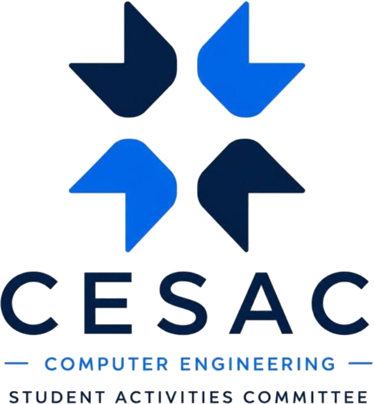

<p align="center">
  
</p>

<h1 align="center">進撃のトークン<br/>ATTACK ON TOKEN</h1>

<p align="center">
  <em>Forge the prompt. Survive the token. Build what comes next.</em>
</p>

<p align="center">
  
  
  
  
  
</p>

<p align="center">
  The event site for <b>Attack on Token</b> — the prompt engineering hackathon run by
  <b>CESAC</b>, the Computer Engineering Student Activities Committee at
  <b>VIT Pune</b>.
</p>

---

## ⚔ The Mission

Three chapters. One battlefield. Fifty teams enter behind Wall I, a leaderboard
cuts them down at Wall II, and a physical build sprint decides who's left standing
at Wall III.

| | |
| --- | --- |
| **Cap** | 100 students · 50 duo teams |
| **Entry** | ₹200 / team (₹100 per head) |
| **Chapters** | 3 — Vision → Trials → Build |
| **Venue / date** | TBA |

| Wall | Chapter | Cuts to | What happens |
| --- | --- | --- | --- |
| I | **Vision Forge** — 幻視の鍛冶 | Top 20 | Image + video generation in Gemini and Google Flow/Veo, scored on prompt efficiency |
| II | **Token Trials** — token の試練 | Top 8 | One system prompt per team, run through a hidden adversarial benchmark, live leaderboard |
| III | **Fusion Awakening** — 融合の覚醒 | Champion | Draw three chits, trade in the market, build a working prototype in one sprint, pitch it |

Full rules, rubrics, run-of-show and the committee roster live on the site itself
(`src/lib/data/`) — this README stays scoped to running and understanding the codebase.

## 🩸 Design Language

Built off four reference boards, not the sponsorship deck's print layout. See
[`New inspo/`] for the boards this pulls from.

**Palette**

| | Token | Hex |
| --- | --- | --- |
|  | `--cream` | `#F5F1E7` |
|  | `--ink` | `#15141A` |
|  | `--red` | `#E51F2C` |
|  | `--red-deep` | `#B3141F` |
|  | `--red-soft` | `#FF6B74` |
|  | `--teal` | `#12656F` |
|  | `--muted` | `#6B6A72` |

**Type** — Anton for tall condensed headlines, Archivo 900 for the wide statement
word and all UI text, Playfair Display italic for ledes and asides, system mincho
for Japanese.

**Influences**

- **Reika / Cyberpunk** — cream washi ground, one saturated red, a giant display
  word, `LVL-20`-style micro labels
- **Crypko** — cream frame around a deep teal panel, notched tab, rotating seal,
  clipped-corner plates
- **Samurai** — carousel dots, pill buttons, vertical kanji watermark
- **Yonika** — floating pill navbar, near-black panel, serif-italic voice, fanned
  card deck, gradient strip

Custom classes live in `@layer components` in `globals.css`, so Tailwind
utilities still override them. All artwork — the Token Titan, the wings crest,
the wall, the chapter plates — is original flat vector in
`src/components/aot/art.tsx` and `src/components/sections/chapter-art.tsx`. No
copyrighted characters, frames, or logos.

## 🛠 Stack

Next.js 16 (App Router, Turbopack) · React 19 · TypeScript 5 · Tailwind CSS 4 ·
Framer Motion · lucide-react

## 🚀 Quick Start

```bash
npm install
npm run dev     # http://localhost:3000
npm run build
npm run lint
```

## 🗂 Structure

```
src/app/
  page.tsx              one scrolling landing page
  signin/page.tsx        sign-in front door (participant + admin)
src/components/
  aot/                   art, seal, reveal, meter, shared bits
  sections/              one file per landing section
  site/                  header, footer
src/lib/data/
  event.ts               deck content — snapshot, chapters, awards, schedule
  committee.ts            department committee + team roster
```

Page order: hero → event snapshot → three walls → the three chapters → awards →
operations → department committee → team → sponsorship → footer.

## 📜 Sourcing

Nothing in the copy is invented. Where the sponsorship deck says TBD or
placeholder, the site says TBA — dates, venue and prize pool included.

| Source | Used for |
| --- | --- |
| `Attack_on_Token_Sponsorship_Pitch.pdf` | Content only — every number, rule, rubric and schedule |
| The four reference boards in `New inspo/` | Design language only — type, colour, shape, layout devices |
| `CESAC TEAM.xlsx` | Faculty, board, associates and the four verticals |
| `logo.jpeg` | `public/cesac-logo.png` (background removed) |

## 🧭 Roadmap

- [x] Landing page — hero through footer
- [x] Sign-in front door (UI only)
- [ ] Registration flow — the sign-in form doesn't submit anywhere yet
- [ ] Participant dashboard
- [ ] Admin pages

## 🤝 Contributing

This is CESAC's internal event build, run by the Computer Engineering department
at VIT Pune. If you're on the team: branch off `main`, keep content changes
scoped to `src/lib/data/`, keep design changes scoped to `src/components/`, and
run `npm run lint` before you open a PR. External contributions aren't expected,
but issues on scope are welcome.

## 👤 About Me

Built by **Viral Dhoka** ([@viralala](https://github.com/viralala)) — Associate,
CESAC (Computer Engineering Student Activities Committee), VIT Pune.

CESAC runs Attack on Token end to end — planning, design, and this site — under
the department's faculty leadership. This repo is that build: the landing page,
the chapter system, the committee roster, and the visual identity for the event.

Reach out: [viral.1251070777@vit.edu](mailto:viral.1251070777@vit.edu)

## 📄 License

Code in this repository is licensed under the [MIT License](LICENSE) ©
2026 Viral Dhoka.

The CESAC name, crest, and the "Attack on Token" event identity belong to CESAC
and the Computer Engineering department at Vishwakarma Institute of Technology,
Pune, and are not covered by the MIT grant — don't reuse them to represent a
different event or organization.
